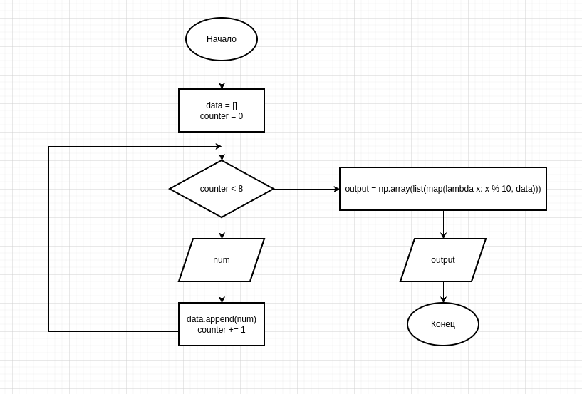

# Информатика второй семестр Берестов Б.А 

## Зависимости:
- python 3.11
- Тестирование всего проводилось на Linux
- Модули в requirements.txt

## Запуск:

Каждое задание расположено в файлах f1 - f5.py

## Блок схемы:
### Задание 1

### Задание 2

### Задание 3

### Задание 4

Документация расположена в [Файле с классами](f4_extra/readme.md)

### Задание 5
